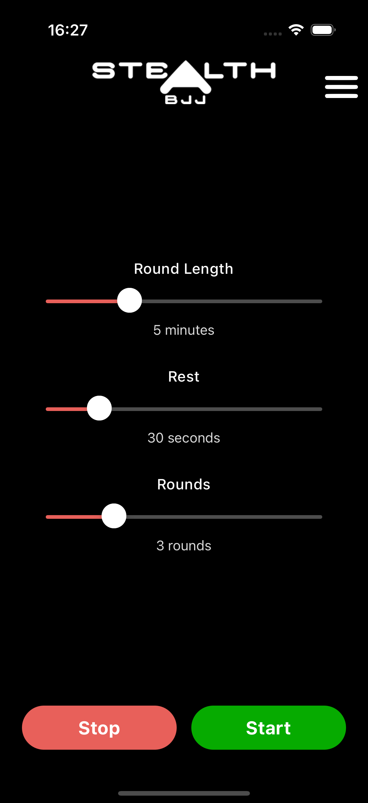
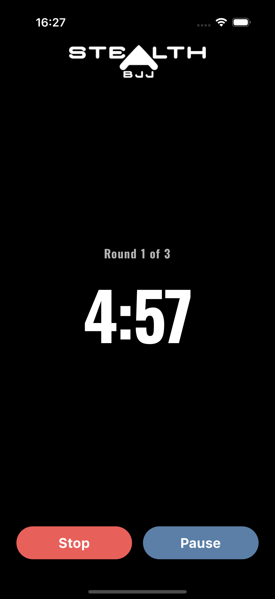
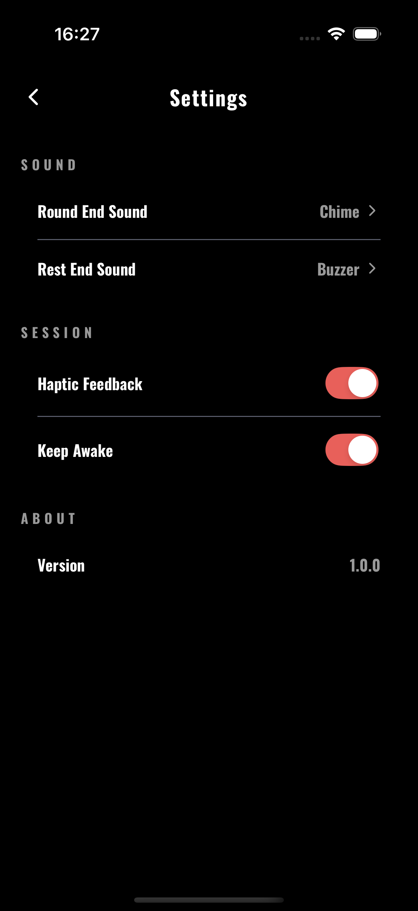
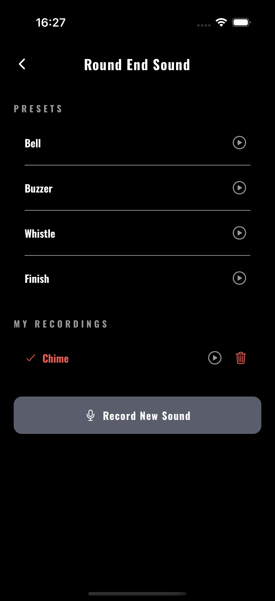

# Stealth BJJ Timer

A Brazilian Jiu-Jitsu round timer app built with React Native and Expo, developed for Stealth BJJ. Built as a real-world portfolio project demonstrating clean React Native architecture, native device integration, and production App Store deployment.

---

## Screenshots

| Home                                 | Timer                                  | Settings                                     | Sound Picker                                        |
| ------------------------------------ | -------------------------------------- | -------------------------------------------- | --------------------------------------------------- |
|  |  |  |  |

---

## Features

- Configurable round length (1–15 minutes), rest periods (0–3 minutes in 10s increments), and number of rounds (1–10)
- Visual and audio cues at round and rest end
- Separate sounds for round end and rest end
- Preset sounds (Bell, Buzzer, Whistle, Finish, OG) with in-app preview
- Custom sound recording via device microphone
- Haptic feedback on round transitions
- Keep Awake — screen stays on during session
- Settings persist between sessions via AsyncStorage
- Animated splash screen
- Dark mode throughout

---

## Tech Stack

- **React Native** with **Expo SDK 54**
- **Expo Router** — file-based navigation
- **Zustand** — global state management with AsyncStorage persistence
- **expo-av** — audio playback and recording
- **expo-haptics** — haptic feedback
- **expo-keep-awake** — screen management
- **TypeScript** throughout
- **Jest** + **React Native Testing Library** — unit tests
- **ESLint** + **Prettier** — code quality

---

## Project Structure

```
stealth-timer/
├── app/                    # Screens (Expo Router file-based routing)
│   ├── _layout.tsx         # Root layout, fonts, splash animation
│   ├── index.tsx           # Home screen (session configuration)
│   ├── countdown.tsx       # Timer screen
│   ├── settings.tsx        # Settings screen
│   ├── soundPicker.tsx     # Sound selection screen
│   └── recordSound.tsx     # Custom sound recording screen
├── components/
│   ├── UI/
│   │   ├── Button.tsx      # Reusable button
│   │   ├── Slider.tsx      # Reusable slider
│   │   ├── Card.tsx        # Settings card container
│   │   ├── ListItem.tsx    # Tappable list row
│   │   ├── Toggle.tsx      # Switch row
│   │   └── SectionHeader.tsx
│   ├── Controls.tsx        # Stop/Start button pair
│   ├── Timer.tsx           # Countdown display
│   ├── Logo.tsx            # App logo
│   └── ScreenWrapper.tsx   # SafeAreaView wrapper
├── hooks/
│   ├── useTimer.ts         # Timer logic with rest periods
│   ├── useSound.ts         # Sound playback
│   ├── useHaptics.ts       # Haptic feedback
│   └── useKeepAwake.ts     # Screen keep awake
├── store/
│   ├── useSessionStore.ts  # Round/rest/session settings
│   └── useSettingsStore.ts # Sound, haptics, keep awake
├── constants/
│   ├── theme.ts            # Colors, typography, spacing
│   └── storage.ts          # AsyncStorage keys
└── __tests__/
    ├── hooks/
    │   └── useTimer.test.ts
    └── components/
        └── TimerDisplay.test.tsx
```

---

## Getting Started

### Prerequisites

- Node.js v18 or later
- Expo Go app (iOS/Android) or a development build

### Installation

```bash
git clone https://github.com/DigOut25/Stealth-Timer
cd stealth-timer
npm install
npx expo start
```

Scan the QR code with Expo Go or press `i` for iOS simulator / `a` for Android emulator.

### Running Tests

```bash
npm test               # run all tests
npm run test:watch     # watch mode
npm run test:coverage  # with coverage report
```

### Linting and Formatting

```bash
npm run lint           # check for issues
npm run lint:fix       # auto fix
npm run format         # format all files
```

---

## Architecture Decisions

**Zustand over Redux** — lightweight global state without boilerplate. `persist` middleware handles AsyncStorage automatically so session settings survive app restarts.

**Custom hooks for logic separation** — `useTimer`, `useSound`, `useHaptics` and `useKeepAwake` keep screens clean and logic independently testable.

**Refs alongside state in useTimer** — `isRestingRef` and `currentRoundRef` prevent stale closure issues inside `setInterval` callbacks while state values drive the UI.

**File-based routing with Expo Router** — clean navigation structure, type-safe params, and easy deep linking.

---

## Building for Production

This project uses EAS Build for production builds.

```bash
# Install EAS CLI
npm install -g eas-cli

# Login
eas login

# Production build
eas build --profile production --platform ios

# Submit to App Store
eas submit --platform ios
```

---

## Licence

Built for Stealth BJJ. All rights reserved.
